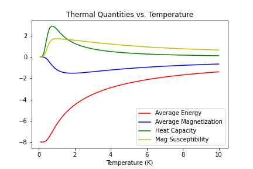

Getting Started
===============

This page details how to get started with MonteCarlo.

Installation
------------
This package was developed for use in Python 3.9. It has the following dependencies:

* numpy
* matplotlib (optional)

Use the commands below to install this package in an environment where the above requirements
are met.

::

 git clone git@github.com:y-pleim/MonteCarlo.git
 cd MonteCarlo
 pip install -e .

Background
----------
Model
'''''
This package is based on a simple, one-dimensional model of magnetism where each site in a material hosts a particle
(typically an electron) with an intrinsic magnetic moment. Such a site can either be spin-up or spin-down. The collection of
spins can be described by a spin configuration, which is a list containing the spin value for each site. For example,
for a spin system with N = 8 sites, a possible configuration is:

.. math:: \uparrow , \uparrow , \downarrow , \uparrow , \downarrow , \downarrow , \uparrow , \downarrow .

Such a configuration is represented by this package as a list of 0's and 1's, where a 0 entry represents a down spin
and a 1 entry represents an up spin.

The macroscopic properties of the collection of spins are based on the coupling between adjacent spins and the effects
of an external energy bias (e.g., an external magnetic field). The energy of a spin configuration is calculated according
to the Ising Hamiltonian:

.. math:: E = \frac{H}{k} = -\frac{J}{k}\sum_{<ij>} x_ix_j + \frac{\mu}{k}\sum_{i} x_i

where the x terms are either -1 (down spin) or +1 (up spin). Another pertinent property of such a system is the magnetization,
which is given by

.. math:: M = N_\uparrow - N_\downarrow

i.e., the number of sites containing an up spin minus the number of sites containing a down spin in a specific
configuration. 

If desired, periodic boundary conditions can be imposed on the system simulated by this package.

Thermal Quantities
''''''''''''''''''
To determine thermal averages, this package employs the canonical ensemble. The partition function is the sum of the
Boltzmann factors for each of the possible states (denoted by s) of an N-spin system:

.. math:: Z = \sum_{s}e^{-\epsilon _s/kT}

Using this formalism, the average value of a quantity X is given by

.. math:: <X>~ = \frac{1}{Z}\sum_{s}X(s) e^{-\epsilon _s/kT}

This equation is used to find the average energy, average magnetization, average of the squared energies, and average
of the squared magnetizations of the system. For example, the average energy and magnetization are given by

.. math:: <E>~ = \frac{1}{Z}\sum_{s}\epsilon _s e^{-\epsilon _s/kT}

and

.. math:: <M>~ = \frac{1}{Z}\sum_{s}M_s e^{-\epsilon _s/kT}

respectively. From these average quantities, the heat capacity and magnetic susceptibility are derived:

.. math:: C~ = \frac{<E^2> - <E>^2}{kT^2}

and

.. math:: \chi~ = \frac{<M^2> - <M>^2}{kT}

For the calculations executed by this package, Boltzmann's constant (k) has been set to 1.

Metropolis Sampling
'''''''''''''''''''
Calculating the canonical partition function for a spin system requires finding the energy for each
possible state. As such, for larger N systems the process of calculating thermal quantities becomes
time-consuming.

For larger systems, stochastic sampling methods such as metropolis sampling can be used for a more
efficient determination of these thermal quantities (while introducing some statistical noise in the process).

Starting from a random spin configuration, the following steps are taken to find the next spin configuration
to be included in the calculation of the thermal averages:

* The energy of the configuration is calculated.
* The ith spin is flipped and the energy difference due to this flip is determined.
* To determine whether the new spin configuration should replace the current spin configuration, the ratio of the Boltzmann factors is calculated:

.. math:: \frac{P(new)}{P(current)} = \frac{e^{-E_{new}/kT}}{e^{-E_{current}/kT}} = e^{-\Delta E/kT}

* The result is compared to a randomly generated number from 0 to 1. If the ratio of the Boltzmann factors is larger than this randomly generated number, the
new configuration replaces the current configuration. Otherwise, the current spin configuration is kept. 
* The spin in the i+1 site is flipped, and the same calculations/logic are applied. This process is continued until there are no sites left to examine.

This process (referred to as a metropolis sweep) can be carried out a large number of times. If the number of such steps is sufficiently large, the average
of the values produced by the kept spin configurations will converge to that found in an exact calculation (i.e., applying the canonical ensemble). Increasing
the number of steps generally reduces the amount of noise in the resulting values, but requires an increased computation time.

Examples
--------
Calculating the energy of a configuration
'''''''''''''''''''''''''''''''''''''''''
The following is an example of how to use this package to calculate the energy of a spin configuration:
::

 import montecarlo

 # Create configuration
 spins = montecarlo.SpinConfiguration()
 spins.initialize([0,1,1,1,0,1])

 # Create hamiltonian with desired values of mu, J and the periodic boundary conditions flag
 ham = montecarlo.Hamiltonian()
 ham.initialize(-2,1.1,True)
 
 # Compute energy
 energy = ham.compute_energy(spins)

 print("Spin configuration:", spins)
 print("Energy:", round(energy,1))

This should produce the following output:
::

 Spin configuration: 0, 1, 1, 1, 0, 1.
 Energy: -1.8

Generating a random spin configuration and additional functions
'''''''''''''''''''''''''''''''''''''''''''''''''''''''''''''''
The following example demonstrates how to create and print a random spin configuration with N=8 sites. The functionality
of the n_sites method is also demonstrated.
::
 
 import montecarlo
 import random
 
 # Create spin configuration object
 spins = montecarlo.SpinConfiguration()

 # Generate a random spin configuration based on seed value 2
 random.seed(2)
 spins.randomize(8)
 
 # Get number of sites
 num_sites = spins.n_sites()
 
 # Prints output
 print("Spin configuration:", spins)
 print("Number of sites in configuration:", num_sites)
 
This should produce the following:
::
 
 Spin configuration: 0, 0, 0, 1, 0, 1, 1, 0.
 Number of sites in configuration: 8

Calculating average thermal quantities
''''''''''''''''''''''''''''''''''''''
An example of calculating the average energy, average magnetization, heat capacity and magnetic susceptibility
of an N=8 spin system at temperature T = 10K is given below:
::

 import montecarlo
 import numpy as np

 # Create spin configuration system

 spin_system = montecarlo.SpinConfigurationSystem()
 spin_system.initialize(8)

 # Create Hamlitonian
 ham = montecarlo.Hamiltonian()
 ham.initialize(-2,1.1,True)

 # Calculate thermal quantities
 temperature = 10
 avg_energy = ham.compute_average_energy(temperature, spin_system)
 avg_magnetization = ham.compute_average_mag(temperature, spin_system)
 heat_capacity = ham.compute_heat_capacity(temperature, spin_system)
 mag_susceptibility = ham.compute_mag_susceptibility(temperature, spin_system)

 # Prints output
 print("Average Energy:", round(avg_energy,1))
 print("Average Magnetization:", round(avg_magnetization,1))
 print("Heat Capacity:", round(heat_capacity,1))
 print("Magnetic Susceptibility:", round(mag_susceptibility,1))

This should produce the following output:
::
 
 Average Energy: -3.7
 Average Magnetization: -0.6
 Heat Capacity: 0.3
 Magnetic Susceptibility: 0.5

Generating a plot of average thermal quantities
'''''''''''''''''''''''''''''''''''''''''''''''
This example shows how to generate a plot of the average thermal quantities over a specified
temperature range.
::
 
 import montecarlo
 import numpy as np
 import matplotlib.pyplot as plt

 # Create spin configuration system with N = 8 spins
 spin_system = montecarlo.SpinConfigurationSystem()
 spin_system.initialize(8)

 # Create Hamiltonian
 ham = montecarlo.Hamiltonian()
 ham.initialize(-1,1.01,True)

 # Generate lists to be graphed
 temperatures, energies, magnetizations, heat_caps, mag_suscept = ham.generate_thermal_quantities(spin_system,0.1,10,0.1)

 # Creates plot
 plt.plot(
  temperatures, energies, 'r-',
  temperatures, magnetizations, 'b-',
  temperatures, heat_caps, 'g-',
  temperatures, mag_suscept, 'y-'
 )
 plt.legend(["Average Energy", "Average Magnetization", "Heat Capacity", "Mag Susceptibility"],loc='best')
 plt.xlabel("Temperature (K)")
 plt.title("Thermal Quantities vs. Temperature")

This should produce the following plot:

Calculating thermal quantities for an N=50 spin system using metropolis sampling
''''''''''''''''''''''''''''''''''''''''''''''''''''''''''''''''''''''''''''''''
This example shows how to calculate the thermal average quantities of an N=50 spin system at a
specific temperature (T = 10K, in this case).

Generating a plot of average thermal quantities using metropolis sampling
'''''''''''''''''''''''''''''''''''''''''''''''''''''''''''''''''''''''''
